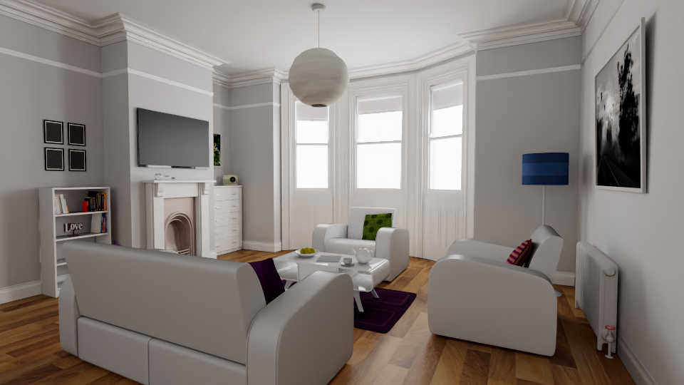
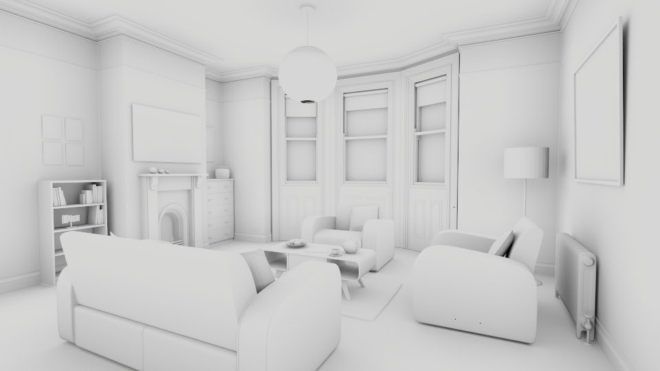
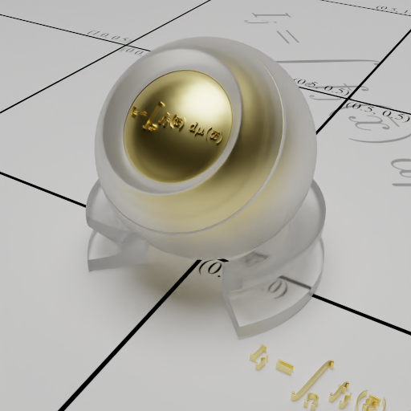
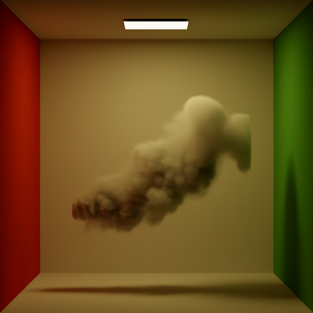
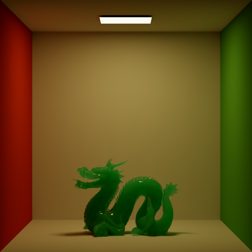
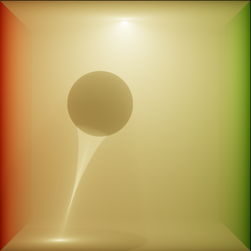
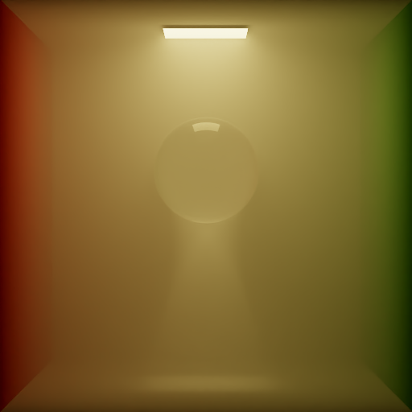

GPUPathtracer
=============

physically based path tracer on gpu

特点
----

- 积分器(ambient occlusion, path tracing, light tracing, volumetric path tracing, bidirectional path tracing)
- 材质(lambertian, mirror, dielectric, roughdielectric, roughconduct, substrate)
- 参与介质渲染(homogeneous and heterogeneous)
- 光源(area infinite)
- 多重重要性采样(mis)
- 景深(dof)
- 简单的场景加载(simple scene loader)

依赖库
----
需要CUDA9.1以上

关于场景
------
鉴于场景太大，所以只放了一个简单的测试场景供使用，如果需要，可以联系我将其余场景提供给你

图集
---
<table> <tr>
    <td>  </td>
    <td>  </td>
    <td>  </td>
</tr> <tr>
    <td>  </td>
    <td>  </td>
    <td>  </td>
</tr> </table
