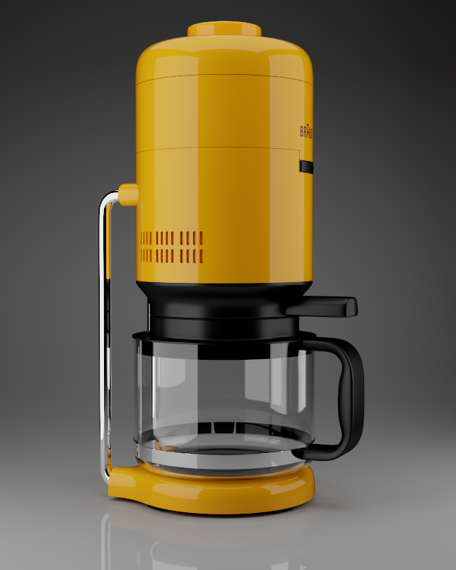
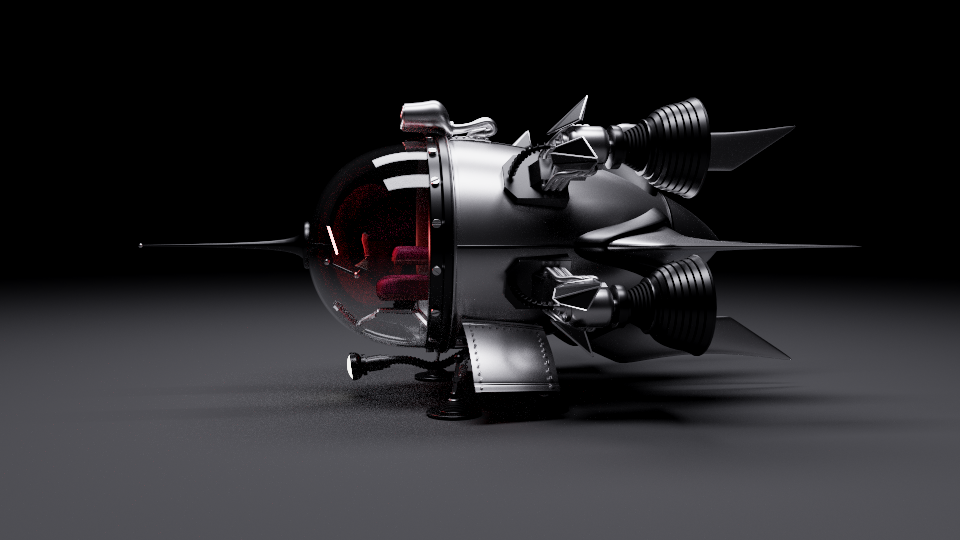
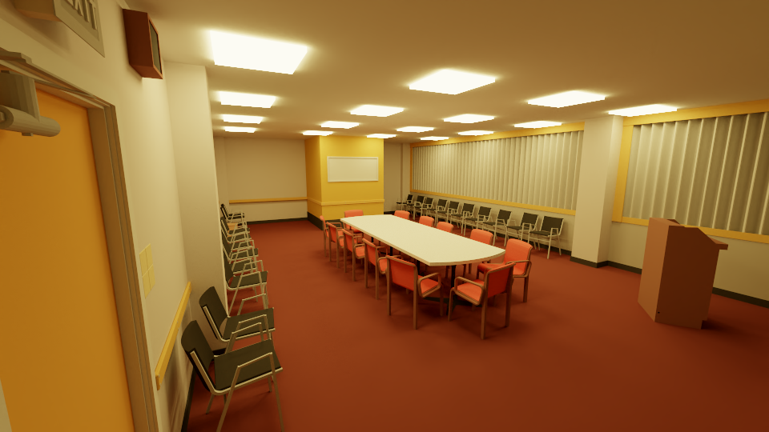

GPUPathtracer
=============

physically based path tracer on gpu

特点
----

- 路径追踪器
- 材质(lambertian mirror dielectric metal substrate)
- 面积光源
- 多重重要性采样
- 景深
- 简单的场景加载

依赖库
----
需要CUDA9.1以上

图集
---

